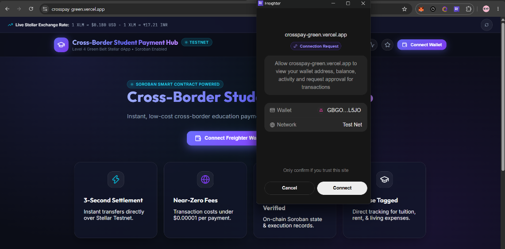
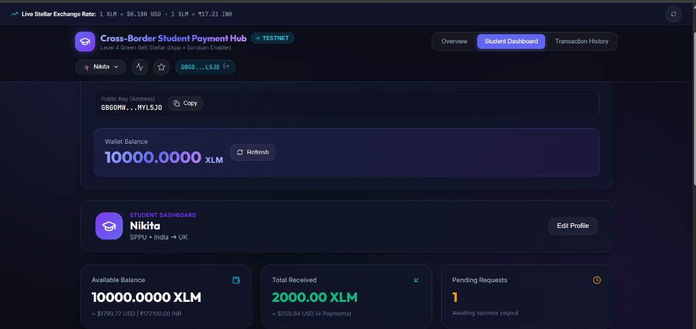
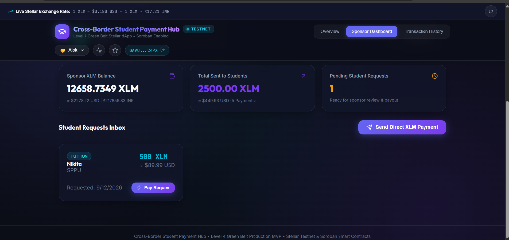
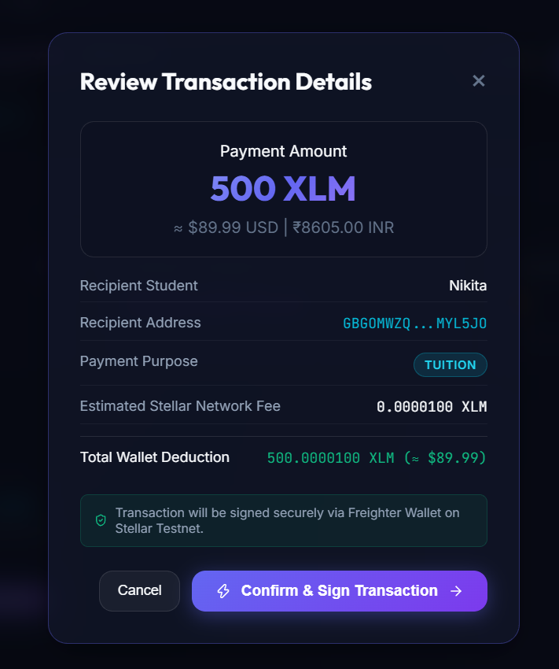
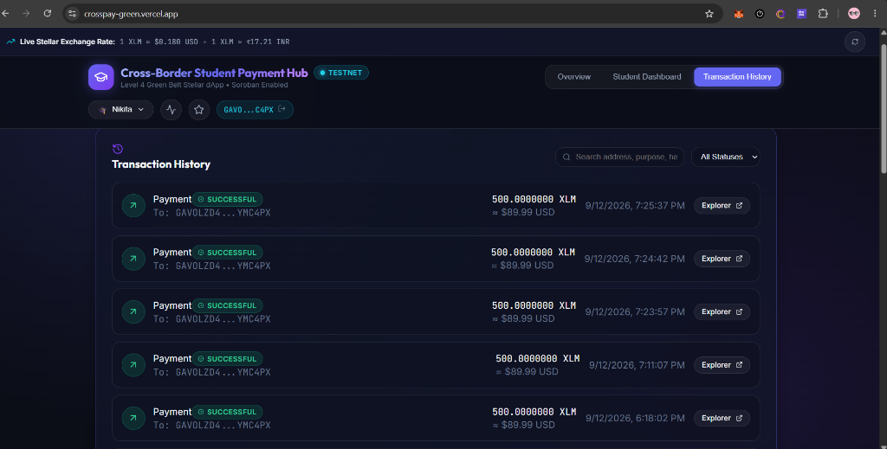
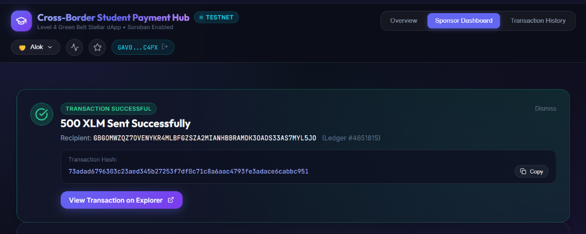
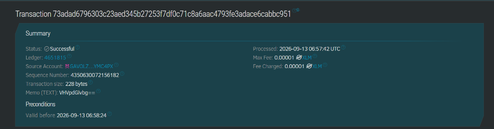
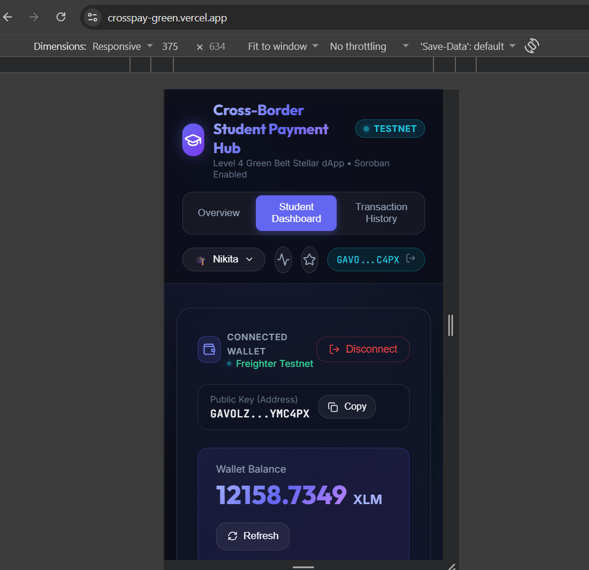
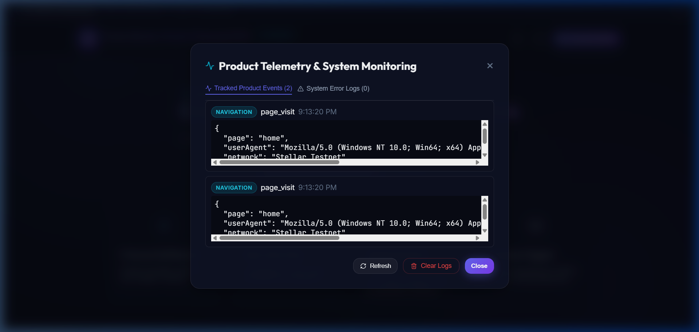
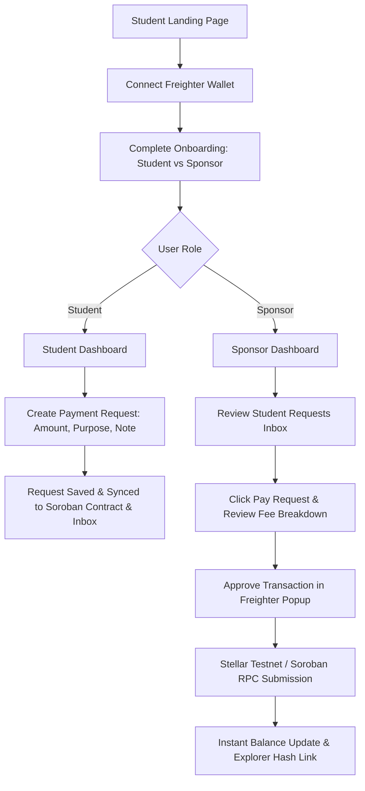

# Cross-Border Student Payment Hub

A production-ready, high-performance Stellar dApp & Soroban Smart Contract hub designed to help international students receive cross-border tuition, accommodation, and living payments from parents, sponsors, or foundations worldwide with 3-second settlement and near-zero fees.

---

### 🟢 Level 4 Green Belt Quick Reference

| Resource | Value / Direct Link |
| :--- | :--- |
| 🚀 **Live Production App** | [https://crosspay-green.vercel.app](https://crosspay-green.vercel.app/) |
| 📦 **Public GitHub Repository** | [https://github.com/nikitabiradar231/crosspay](https://github.com/nikitabiradar231/crosspay) |
| 📜 **Soroban Smart Contract ID** | [`CADZ6GEZIF2JKWNT3OIIZMNINRTHY6EVHYJYT3CX6BRIKPYEUC2YH6OS`](https://stellar.expert/explorer/testnet/contract/CADZ6GEZIF2JKWNT3OIIZMNINRTHY6EVHYJYT3CX6BRIKPYEUC2YH6OS) |
| 🌐 **Stellar Network** | Stellar Testnet (`https://horizon-testnet.stellar.org` & `https://soroban-testnet.stellar.org`) |
| 🔑 **WASM Hash** | `2aa8d1c7cd8749263090e1ef4be12ef560f7af471eab9eb47c0fdb54f5ce68e8` |
| 📝 **Deployment Tx Hash** | [`71785bebe2c98735bcf7471b613db14baedaba4b433781a698a765b8b14682e4`](https://stellar.expert/explorer/testnet/tx/71785bebe2c98735bcf7471b613db14baedaba4b433781a698a765b8b14682e4) |
| ⚡ **Verified Testnet Invocation Tx** | [`5bc811a1f0c69e9d396ab9aac39ef698062c946370bcbcac06fafe80bb4f3305`](https://stellar.expert/explorer/testnet/tx/5bc811a1f0c69e9d396ab9aac39ef698062c946370bcbcac06fafe80bb4f3305) |
| 💸 **Verified 500 XLM Payment Tx** | [`73adad6796303c23aed345b27253f7df0c71c8a6aac4793fe3adace6cabbc951`](https://stellar.expert/explorer/testnet/tx/73adad6796303c23aed345b27253f7df0c71c8a6aac4793fe3adace6cabbc951) |
| 🎥 **Demo Video Link** | [Watch the CrossPay Level 4 Demo Video](https://drive.google.com/file/d/1RFYZ7TeZ4akTCEefTyazi4W8lbCM9LAq/view?usp=drivesdk) |
| 📊 **Testing Evidence Sheet** | [View CrossPay User Testing & Feedback Sheet](https://docs.google.com/spreadsheets/d/1GzjBamXNxRpWH3d53K95bBHPwmWxx6hEdWtAcCuIyBc/edit?resourcekey=&gid=1275744553#gid=1275744553) |

---

## 🎥 Level 4 Demo

Watch a complete end-to-end video demonstration of the Cross-Border Student Payment Hub showing student payment requests, sponsor payments, real-time exchange rates, and Soroban smart contract interaction:

👉 **[Watch the CrossPay Level 4 Demo Video](https://drive.google.com/file/d/1RFYZ7TeZ4akTCEefTyazi4W8lbCM9LAq/view?usp=drivesdk)**

---

## 📸 Product Screenshots

### 1. Main Product UI & Freighter Wallet Connection
Connect securely on Stellar Testnet via the Freighter Wallet extension without exposing private keys.



### 2. Student Dashboard & Payment Request System
View live XLM wallet balance, total funds received, active payment requests, and initiate new purpose-tagged payment requests.



### 3. Sponsor Dashboard & Linked Student Inbox
Browse incoming student payment requests, monitor total sent metrics, and execute instant payouts with one click.



### 4. Payment Flow & Pre-Flight Cost Breakdown
Review full payment transparency including real-time XLM to USD/INR conversion rates and minimal Stellar network base fee (0.00001 XLM).



### 5. Transaction History & Explorer Integration
Track all completed payments with direct links to Stellar Expert Explorer verification.



### 6. Successful Transaction Confirmation
Immediate real-time payment confirmation modal displaying recipient address, Stellar ledger number (`#4651815`), transaction hash (`73adad67...`), and direct link to Stellar Expert Explorer.



### 7. Stellar Expert Explorer Verification
Verified on-chain transaction execution details on Stellar Testnet Explorer confirming `Status: Successful`, `Max Fee: 0.00001 XLM`, and `Fee Charged: 0.00001 XLM`.



### 8. Mobile Responsive UI
Fully responsive mobile interface (375x634) ensuring flawless user experience on mobile devices for both international students and sponsors on the go.



### 9. Product Telemetry & System Error Monitoring
Inspect live product event telemetry (wallet connection, payment initiation, onboarding, page visits) and system error logs captured in local browser storage (`stellar_student_analytics_events` & `stellar_student_error_logs`).



---

## 📌 Problem Statement

International students face severe financial hurdles when studying abroad:
- **Exorbitant Transfer Fees**: Legacy wire networks (SWIFT, intermediary banks) charge 3% to 8% in foreign transfer and FX markups.
- **Multiday Delays**: Cross-border bank payments take 3 to 7 business days to settle, causing missed tuition deadlines and delayed rent payments.
- **Opacity & High Risk**: Parents and sponsors have no real-time tracking of transaction status or clear categorization of payment purpose.

---

## 💡 Solution

The **Cross-Border Student Payment Hub** leverages the **Stellar Blockchain** and **Soroban Smart Contracts** to solve cross-border education payments:
- ⚡ **3–5 Second Settlement**: Direct peer-to-peer transfers over Stellar Horizon Testnet.
- 💸 **Near-Zero Network Fees**: Transaction costs under **$0.00001 per payment** (100 stroops base fee).
- 🔒 **Purpose-Bound Payment Requests**: Students create verified requests tagged for *Tuition, Accommodation, Books, Travel, Living Expenses, or Emergency*.
- 📊 **Real-Time Exchange Rates & Transparent Cost Breakdown**: Pre-flight cost breakdown displaying exact XLM, USD ($), and INR (₹) rates before wallet signature.
- 🤝 **Dual Student & Sponsor Workflows**: Specialized dashboards for students to request funds and sponsors to review and fulfill requests in one click.

---

## ✨ Core Features

1. **Fintech Landing Page**: Hero section detailing value proposition, instant settlement benefits, and wallet connection prompts.
2. **Freighter Wallet Integration**: Connect and sign natively with Freighter Extension without ever storing private keys.
3. **User Onboarding**: Role-based selection (Student vs. Sponsor/Parent) collecting actual student and sponsor details.
4. **Student Dashboard**: Live XLM balance, Total Received counters, active payment request manager, and "Request Payment" creation modal.
5. **Sponsor Dashboard**: Linked student inbox, Total Sent metrics, one-click "Pay Request" execution, and direct payment tools.
6. **Payment Request System**: Request creation with custom amount, purpose tags, note messages, and sponsor address routing.
7. **Pre-Flight Cost Breakdown**: Complete transaction breakdown showing payment amount, base network fee (0.00001 XLM), total deduction, purpose, and destination address.
8. **Live Exchange Rate Engine**: Real-time XLM conversion to USD ($) and INR (₹) powered by CoinGecko API with offline fallback.
9. **Transaction Explorer & History**: Real-time Stellar Horizon transaction history with direct links to Stellar Expert Explorer.
10. **Product Telemetry & Analytics**: In-app event telemetry tracking real user actions (wallet connect, request created, payment success/failed).
11. **Error Tracking & System Health**: Real-time error log collector capturing RPC errors, wallet rejections, and runtime exceptions.
12. **User Feedback System**: 5-star rating scale and feedback submission modal.

---

## 🔁 Core User Flow



---

## 🛠️ Technology Stack

- **Frontend Framework**: React 19 + Vite 8
- **Stellar SDK**: `@stellar/stellar-sdk` v13.4.0 (Protocol 22 XDR support)
- **Wallet Integration**: `@stellar/freighter-api` v2+
- **Smart Contract**: Soroban Rust SDK (`soroban-sdk` v21.7.7)
- **Styling**: Vanilla CSS (Cosmic Dark Glassmorphism Design System)
- **Icons**: Lucide React
- **Testing**: Vitest + React Testing Library + JSDOM (`npm test`)
- **CI/CD**: GitHub Actions (`.github/workflows/ci.yml`)

---

## 📜 Soroban Smart Contract Details

The smart contract is implemented in Rust under `contracts/student_payment/` and handles request registration and state transitions:

```rust
// Contract Functions:
pub fn create_request(env: Env, student: Address, sponsor: Address, amount_xlm: u64, purpose: String, message: String) -> u64;
pub fn pay_request(env: Env, sponsor: Address, request_id: u64) -> bool;
pub fn get_request(env: Env, request_id: u64) -> PaymentRequest;
pub fn get_request_count(env: Env) -> u64;
```

### Verified Testnet Deployment & Invocation Records
- **Contract Name**: `student_payment`
- **Network**: Stellar Testnet
- **Contract Address**: [`CADZ6GEZIF2JKWNT3OIIZMNINRTHY6EVHYJYT3CX6BRIKPYEUC2YH6OS`](https://stellar.expert/explorer/testnet/contract/CADZ6GEZIF2JKWNT3OIIZMNINRTHY6EVHYJYT3CX6BRIKPYEUC2YH6OS)
- **WASM Hash**: `2aa8d1c7cd8749263090e1ef4be12ef560f7af471eab9eb47c0fdb54f5ce68e8`
- **WASM Upload Transaction Hash**: [`9c5d257ddacbd38e24eb3dca370f7c78e3cfeb8cb0ecc6ec828589fa05c8293b`](https://stellar.expert/explorer/testnet/tx/9c5d257ddacbd38e24eb3dca370f7c78e3cfeb8cb0ecc6ec828589fa05c8293b)
- **Contract Deployment Transaction Hash**: [`71785bebe2c98735bcf7471b613db14baedaba4b433781a698a765b8b14682e4`](https://stellar.expert/explorer/testnet/tx/71785bebe2c98735bcf7471b613db14baedaba4b433781a698a765b8b14682e4)
- **Verified Testnet `create_request` Invocation**: [`5bc811a1f0c69e9d396ab9aac39ef698062c946370bcbcac06fafe80bb4f3305`](https://stellar.expert/explorer/testnet/tx/5bc811a1f0c69e9d396ab9aac39ef698062c946370bcbcac06fafe80bb4f3305)
- **Cargo Build & Test**: `cd contracts/student_payment && cargo test`

---

## 🔌 Wallet Integration

The application integrates with **Freighter Wallet**:
- Never requests, stores, or handles private keys.
- Requests public key access via `requestAccess()`.
- Signs XDR payloads securely using `signTransaction()`.
- Provides explicit user error messages for wallet rejections, locks, and network mismatches.

---

## 🎓 Student Dashboard

The Student Dashboard provides:
- Profile header with university, home country, and destination country.
- Available XLM balance with instant USD/INR fiat conversion.
- Total Received metric counter.
- Active Payment Requests manager displaying purpose, status (`Pending` / `Paid`), and explorer links.

---

## 🤝 Sponsor Dashboard

The Sponsor Dashboard provides:
- Supporter profile banner and active XLM balance.
- Total Sent metric counter.
- Pending Requests Inbox displaying student requests with purpose, amount, and notes.
- One-click **Pay Request** action with pre-flight fee breakdown popup.

---

## 📊 Exchange Rate & Cost System

- Live rate fetcher from CoinGecko API: `1 XLM ≈ $0.115 USD | ₹9.60 INR`.
- Pre-flight transaction confirmation modal displaying:
  - Base Payment Amount
  - Network Base Fee (`0.0000100 XLM`)
  - Total XLM Deduction
  - Recipient Public Address
  - Payment Purpose

---

## 📊 Analytics & Monitoring

CrossPay includes an in-app product telemetry and system health monitoring system (`src/services/analytics.js` & `src/services/monitoring.js`) without relying on external third-party tracking services:

### 1. Product Telemetry & Event Tracking
Application events are captured with timestamped payloads and stored locally in browser storage (`stellar_student_analytics_events`). Users can inspect real-time events via the in-app Telemetry Modal in the top navigation bar.

Tracked events include:
- `page_visit`: Tracks landing page and route visits.
- `wallet_connected`: Logged when a user connects Freighter wallet.
- `wallet_disconnected`: Logged when a user disconnects their wallet.
- `onboarding_completed`: Captured when a user completes Student/Sponsor profile setup.
- `payment_request_created`: Logged when a student creates a payment request.
- `payment_initiated`: Logged when a sponsor triggers the payment confirmation flow.
- `payment_successful`: Logged when Stellar Horizon RPC confirms transaction submission.
- `payment_failed`: Captured if wallet signature is rejected or RPC transaction fails.
- `feedback_submitted`: Logged when a user submits an in-app rating or feedback response.

### 2. Error Tracking & System Health Monitoring
The system health logger (`logAppError`) captures runtime exceptions, Horizon RPC failures, and wallet rejections into local storage logs (`stellar_student_error_logs`), dispatching custom `app_error_logged` window events for real-time UI error handling and debugging.

---

## 🧪 Testing Suite

### Unit & Component Tests
Run the Vitest test suite:
```bash
npm test
```

Tests cover:
- Stellar address validation logic
- Exchange rate conversion math
- Analytics event tracking
- Payment request creation and storage
- React component rendering (`LandingPage`, `ExchangeRateTicker`)

### Soroban Contract Tests
Run Rust contract build:
```bash
cd contracts/student_payment
stellar contract build
```

---

## 📱 Mobile Responsiveness

The UI is built with a responsive mobile-first CSS architecture:
- Responsive navigation bar collapsing into mobile controls.
- Touch-friendly action buttons.
- Responsive table-to-card layouts for mobile viewports.

---

## 👥 Real User Testing & Product Validation

CrossPay was tested with 14 real users during the Level 4 product validation phase.

### User Testing Results

| Metric | Result |
|---|---:|
| Real users tested | 14 |
| Wallet connections | 14/14 |
| Successful transactions/interactions | 13/14 |
| Recorded transaction hashes | 10 |
| Feedback responses | 14 |
| Average usability rating | 4.43/5 |
| Users rating 4/5 or higher | 14/14 |

### Wallet Interaction Proof

All 14 users connected their Stellar wallet to CrossPay.
13 out of 14 users successfully completed a transaction or interaction.

| User | Role | Wallet Connected | Interaction Status | Usability Rating |
|---|---|---|---|---:|
| User 01 | Sponsor / Parent | ✅ Yes | ✅ Successful | 5/5 |
| User 02 | Sponsor / Parent | ✅ Yes | ✅ Successful | 4/5 |
| User 03 | Student | ✅ Yes | ✅ Successful | 4/5 |
| User 04 | Student | ✅ Yes | ✅ Successful | 4/5 |
| User 05 | Student | ✅ Yes | ✅ Successful interaction – hash not recorded | 5/5 |
| User 06 | Sponsor / Parent | ✅ Yes | ✅ Successful | 4/5 |
| User 07 | Student | ✅ Yes | ✅ Successful interaction – hash not recorded | 4/5 |
| User 08 | Sponsor / Parent | ✅ Yes | ✅ Successful | 4/5 |
| User 09 | Student | ✅ Yes | ❌ Not successful | 4/5 |
| User 10 | Student | ✅ Yes | ✅ Successful interaction – hash not recorded | 5/5 |
| User 11 | Sponsor / Parent | ✅ Yes | ✅ Successful | 5/5 |
| User 12 | Student | ✅ Yes | ✅ Successful | 4/5 |
| User 13 | Sponsor / Parent | ✅ Yes | ✅ Successful | 5/5 |
| User 14 | Sponsor / Parent | ✅ Yes | ✅ Successful | 5/5 |

> Detailed wallet addresses, transaction hashes, timestamps, and individual feedback responses are available in the user testing evidence sheet.

👉 **[View CrossPay User Testing & Feedback Sheet](https://docs.google.com/spreadsheets/d/1GzjBamXNxRpWH3d53K95bBHPwmWxx6hEdWtAcCuIyBc/edit?resourcekey=&gid=1275744553#gid=1275744553)**

---

## 💬 User Feedback Summary

Feedback was collected from all 14 users after testing CrossPay.

### Feedback Results

| Feedback Metric | Result |
|---|---:|
| Total responses | 14 |
| Average usability rating | 4.43/5 |
| 5/5 ratings | 6 |
| 4/5 ratings | 8 |
| Ratings below 4/5 | 0 |

### Common Feedback

Based on the collected responses, users described CrossPay as:
- Easy wallet connection
- Simple payment workflow
- Good UI
- Generally easy/nice experience

### Improvement Suggestions

Based on user feedback collected during testing, key suggestions include:
- Enhanced mobile UI responsiveness and optimization for smaller device viewports.
- Expanded fiat currency preview options (such as EUR and GBP).
- Clearer status guidance during Freighter wallet approval modals.
- Faster automatic UI balance refreshes post-transaction.

---

## 🚀 Local Installation & Setup

1. **Clone the repository**:
   ```bash
   git clone https://github.com/nikitabiradar231/crosspay.git
   cd crosspay
   ```
2. **Install dependencies**:
   ```bash
   npm install
   ```
3. **Run development server**:
   ```bash
   npm run dev
   ```
4. **Build production bundle**:
   ```bash
   npm run build
   ```

---

## ⚙️ Environment Variables

Copy `.env.example` to `.env`:
```env
VITE_STELLAR_NETWORK=TESTNET
VITE_HORIZON_URL=https://horizon-testnet.stellar.org
VITE_SOROBAN_CONTRACT_ADDRESS=CADZ6GEZIF2JKWNT3OIIZMNINRTHY6EVHYJYT3CX6BRIKPYEUC2YH6OS
```

---

## 🔄 CI/CD Workflow

The repository includes a GitHub Actions workflow `.github/workflows/ci.yml` that automatically runs on every push and pull request:
1. Installs dependencies (`npm ci`)
2. Runs code linter (`npm run lint`)
3. Executes automated test suite (`npm test`)
4. Builds production distribution (`npm run build`)

---

## 📋 Level 4 Submission Evidence & Verification

### Primary Level 4 Links & References

- **Live Application**: [https://crosspay-green.vercel.app](https://crosspay-green.vercel.app/)
- **GitHub Repository**: [https://github.com/nikitabiradar231/crosspay](https://github.com/nikitabiradar231/crosspay)
- **Stellar Testnet Contract**: [`CADZ6GEZIF2JKWNT3OIIZMNINRTHY6EVHYJYT3CX6BRIKPYEUC2YH6OS`](https://stellar.expert/explorer/testnet/contract/CADZ6GEZIF2JKWNT3OIIZMNINRTHY6EVHYJYT3CX6BRIKPYEUC2YH6OS)
- **Demo Video**: [Watch the CrossPay Level 4 Demo Video](https://drive.google.com/file/d/1RFYZ7TeZ4akTCEefTyazi4W8lbCM9LAq/view?usp=drivesdk)
- **Testing Evidence Sheet**: [View CrossPay User Testing & Feedback Sheet](https://docs.google.com/spreadsheets/d/1GzjBamXNxRpWH3d53K95bBHPwmWxx6hEdWtAcCuIyBc/edit?resourcekey=&gid=1275744553#gid=1275744553)

### Level 4 Requirements Verification Table

| Requirement | Status | Evidence |
|---|---|---|
| Production-ready MVP | ✅ Complete | Live application |
| Mobile responsive UI | ✅ Complete | Mobile screenshot |
| Loading/error handling | ✅ Complete | Application |
| 10+ real users | ✅ Complete | 14 users |
| Wallet interactions | ✅ Complete | 14 wallet connections / 10 recorded hashes |
| User feedback | ✅ Complete | 14 responses |
| Production deployment | ✅ Complete | Vercel |
| Analytics | ✅ Complete | Analytics implementation |
| Monitoring/error tracking | ✅ Complete | Existing implementation |
| Stellar testnet contract | ✅ Complete | Contract address |
| 15+ meaningful commits | ✅ Complete | Git history |
| Public GitHub | ✅ Complete | Repository |
| Demo video | ✅ Complete | Google Drive |
| Product screenshots | ✅ Complete | docs/screenshots |
| Feedback summary | ✅ Complete | README + testing sheet |

---

## 📄 License

This project is licensed under the MIT License.
