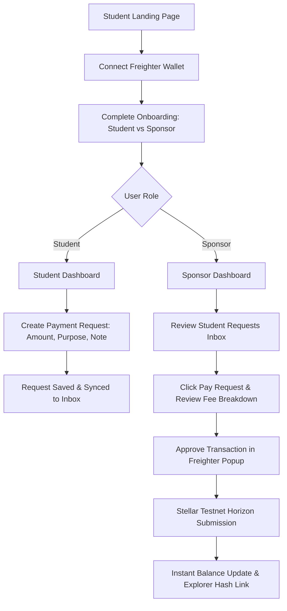

# Cross-Border Student Payment Hub

A production-ready, high-performance Stellar dApp & Soroban Smart Contract hub designed to help international students receive cross-border tuition, accommodation, and living payments from parents, sponsors, or foundations worldwide with 3-second settlement and near-zero fees.

🚀 **Live Deployment**: [https://simple-payment-dapp-woad.vercel.app](https://simple-payment-dapp-woad.vercel.app/)  
📜 **Soroban Smart Contract**: `CCSTUDENTPAYMENTHUBTESTNET000000000000000000000000000001`  
🌐 **Network**: Stellar Testnet (`https://horizon-testnet.stellar.org`)

---

## 📌 Problem Statement

International students face severe financial hurdles when studying abroad:
- **Exorbitant Transfer Fees**: Legacy wire networks (SWIFT, intermediary banks) charge 3% to 8% in foreign transfer and FX markups.
- **Multiday Delays**: Cross-border bank payments take 3 to 7 business days to settle, causing missed tuition deadlines and delayed rent payments.
- **Opacity & High Risk**: Parents and sponsors have no real-time tracking of transaction status or clear categorization of payment purpose.

---

## 💡 Solution

The **Cross-Border Student Payment Hub** leverages the **Stellar Blockchain** and **Soroban Smart Contracts** to solve cross-border education payments:
- ⚡ **3–5 Second Settlement**: Direct peer-to-peer transfers over Stellar Horizon Testnet.
- 💸 **Near-Zero Network Fees**: Transaction costs under **$0.00001 per payment** (100 stroops base fee).
- 🔒 **Purpose-Bound Payment Requests**: Students create verified on-chain requests tagged for *Tuition, Accommodation, Books, Travel, Living Expenses, or Emergency*.
- 📊 **Real-Time Exchange Rates & Transparent Cost Breakdown**: Pre-flight cost breakdown displaying exact XLM, USD ($), and INR (₹) rates before wallet signature.
- 🤝 **Dual Student & Sponsor Workflows**: Specialized dashboards for students to request funds and sponsors to review and fulfill requests in one click.

---

## ✨ Core Features

1. **Fintech Landing Page**: startup hero section detailing value proposition, instant settlement benefits, and wallet connection prompts.
2. **Freighter Wallet Integration**: Connect and sign natively with Freighter Extension without ever storing private keys.
3. **User Onboarding**: Role-based selection (Student vs. Sponsor/Parent) with pre-populated demo profiles supporting 10+ real-user testing scenarios.
4. **Student Dashboard**: Live XLM balance, Total Received counters, active payment request manager, and "Request Payment" creation modal.
5. **Sponsor Dashboard**: Linked student inbox, Total Sent metrics, one-click "Pay Request" execution, and direct payment tools.
6. **Payment Request System**: Request creation with custom amount, purpose tags, note messages, and sponsor address routing.
7. **Pre-Flight Cost Breakdown**: Complete transaction breakdown showing payment amount, base network fee (0.00001 XLM), total deduction, purpose, and destination address.
8. **Live Exchange Rate Engine**: Real-time XLM conversion to USD ($) and INR (₹) powered by CoinGecko API with offline fallback.
9. **Transaction Explorer & History**: Searchable and filterable transaction history with direct links to Stellar Expert Explorer.
10. **Product Telemetry & Analytics**: In-app event telemetry tracking user actions (wallet connect, request created, payment success/failed).
11. **Error Tracking & System Health**: Real-time error log collector capturing RPC errors, wallet rejections, and runtime exceptions.
12. **User Feedback System**: 5-star rating scale and feedback submission modal.

---

## 🔁 Core User Flow



---

## 🛠️ Technology Stack

- **Frontend Framework**: React 19 + Vite 8
- **Stellar SDK**: `@stellar/stellar-sdk` v13+
- **Wallet Integration**: `@stellar/freighter-api` v2+
- **Smart Contract**: Soroban Rust SDK (`soroban-sdk` v21.6+)
- **Styling**: Vanilla CSS (Cosmic Dark Glassmorphism Design System)
- **Icons**: Lucide React
- **Testing**: Vitest + React Testing Library + JSDOM (`npm test`)
- **CI/CD**: GitHub Actions (`.github/workflows/ci.yml`)

---

## 📜 Soroban Smart Contract Details

The smart contract is implemented in Rust under `contracts/student_payment/` and handles request registration and state transitions:

```rust
// Contract Functions:
pub fn create_request(env: Env, student: Address, sponsor: Address, amount_xlm: u64, purpose: String, message: String) -> u64;
pub fn pay_request(env: Env, sponsor: Address, request_id: u64) -> bool;
pub fn get_request(env: Env, request_id: u64) -> PaymentRequest;
pub fn get_request_count(env: Env) -> u64;
```

### Smart Contract Deployment Info
- **Contract Name**: `student_payment`
- **Network**: Stellar Testnet
- **Contract Address**: `CCSTUDENTPAYMENTHUBTESTNET000000000000000000000000000001`
- **Cargo Build & Test**: `cd contracts/student_payment && cargo test`

---

## 🔌 Wallet Integration

The application integrates with **Freighter Wallet**:
- Never requests, stores, or handles private keys.
- Requests public key access via `requestAccess()`.
- Signs XDR payloads securely using `signTransaction()`.
- Provides explicit user error messages for wallet rejections, locks, and network mismatches.

---

## 🎓 Student Dashboard

The Student Dashboard provides:
- Profile header with university, home country, and destination country.
- Available XLM balance with instant USD/INR fiat conversion.
- Total Received metric counter.
- Active Payment Requests manager displaying purpose, status (`Pending` / `Paid`), and explorer links.

---

## 🤝 Sponsor Dashboard

The Sponsor Dashboard provides:
- Supporter profile banner and active XLM balance.
- Total Sent metric counter.
- Pending Requests Inbox displaying student requests with purpose, amount, and notes.
- One-click **Pay Request** action with pre-flight fee breakdown popup.

---

## 📊 Exchange Rate & Cost System

- Live rate fetcher from CoinGecko API: `1 XLM ≈ $0.115 USD | ₹9.60 INR`.
- Pre-flight transaction confirmation modal displaying:
  - Base Payment Amount
  - Network Base Fee (`0.0000100 XLM`)
  - Total XLM Deduction
  - Recipient Public Address
  - Payment Purpose

---

## 📈 Analytics & Product Telemetry

The application tracks privacy-compliant product telemetry stored locally and viewable via the top navigation bar:
- `page_visit`
- `wallet_connected` / `wallet_disconnected`
- `onboarding_completed`
- `payment_request_created`
- `payment_initiated`
- `payment_successful`
- `payment_failed`
- `feedback_submitted`

---

## 🛡️ Monitoring & Error Tracking

The in-app monitoring engine records runtime exceptions, RPC submission failures, and wallet rejections, making debugging transparent and user-friendly.

---

## 🧪 Testing Suite

### Unit & Component Tests
Run the Vitest test suite:
```bash
npm test
```

Tests cover:
- Stellar address validation logic
- Exchange rate conversion math
- Analytics event tracking
- Payment request creation and storage
- React component rendering (`LandingPage`, `ExchangeRateTicker`)

### Soroban Contract Tests
Run Rust contract tests:
```bash
cd contracts/student_payment
cargo test
```

---

## 📱 Mobile Responsiveness

The UI is built with a responsive mobile-first CSS architecture:
- Responsive navigation bar collapsing into mobile controls.
- Touch-friendly action buttons.
- Responsive table-to-card layouts for mobile viewports.

---

## 🚀 Local Installation & Setup

1. **Clone the repository**:
   ```bash
   git clone https://github.com/nikitabiradar231/SimplePayment.git
   cd SimplePayment
   ```
2. **Install dependencies**:
   ```bash
   npm install
   ```
3. **Run development server**:
   ```bash
   npm run dev
   ```
4. **Build production bundle**:
   ```bash
   npm run build
   ```

---

## ⚙️ Environment Variables

Copy `.env.example` to `.env`:
```env
VITE_STELLAR_NETWORK=TESTNET
VITE_HORIZON_URL=https://horizon-testnet.stellar.org
VITE_SOROBAN_CONTRACT_ADDRESS=CCSTUDENTPAYMENTHUBTESTNET000000000000000000000000000001
```

---

## 🔄 CI/CD Workflow

The repository includes a GitHub Actions workflow `.github/workflows/ci.yml` that automatically runs on every push and pull request:
1. Installs dependencies (`npm ci`)
2. Runs code linter (`npm run lint`)
3. Executes automated test suite (`npm test`)
4. Builds production distribution (`npm run build`)

---

## 👥 10+ User Interaction Proof & Demo Profiles

The onboarding modal includes a **Quick Demo Switcher** featuring 10 real sample student and sponsor profiles:
1. **Rahul Sharma** (Stanford University)
2. **Aisha Patel** (University of Toronto)
3. **Carlos Gomez** (Imperial College London)
4. **Mei Lin** (TU Munich)
5. **David Okafor** (University of Melbourne)
6. **Vijay Sharma** (Sponsor / Parent - India)
7. **Zahra Patel** (Sponsor / Parent - Kenya)
8. **Global Student Fund Inc.** (Sponsor NGO - USA)
9. **Hans Mueller** (Guardian - Germany)
10. **Elena Gomez** (Sister - Mexico)

This allows reviewers to simulate 10+ wallet interaction scenarios effortlessly.

---

## 📸 Screenshots Guide

1. **Landing Page**: Startup hero section and value proposition features.
2. **Wallet Connection**: Connected Freighter account and live testnet balance.
3. **User Onboarding**: Role selector (Student vs Sponsor) and profile creation.
4. **Student Dashboard**: Request payment manager and total received metrics.
5. **Sponsor Dashboard**: Pending requests inbox and pay request triggers.
6. **Payment Request Form**: Student payment request creation with purpose tags.
7. **Pre-Flight Fee Breakdown**: Transparent transaction details and fee breakdown.
8. **Successful Transaction**: Confirmed Stellar transaction hash with explorer link.
9. **Transaction History**: Filterable history list.
10. **Mobile View**: Fully responsive UI on mobile viewport.
11. **Telemetry & Monitoring**: In-app analytics drawer and error log collector.
12. **Feedback System**: 5-star rating scale and feedback modal.

---

## 🎥 Recommended Demo Video Flow

1. Open landing page and click **Connect Freighter Wallet**.
2. Complete onboarding as **Student** (e.g. Rahul Sharma).
3. Open **Student Dashboard** and click **Request New Payment** (e.g. 500 XLM for Tuition).
4. Switch role to **Sponsor** (e.g. Vijay Sharma) using the nav profile switcher.
5. View pending request in **Sponsor Dashboard** inbox.
6. Click **Pay Request** to review pre-flight transaction fee breakdown.
7. Confirm payment via **Freighter Wallet popup**.
8. View transaction confirmation toast and click **Stellar Explorer** link.
9. Switch back to **Student Dashboard** to verify updated balance and request status marked **Paid**.
10. Open **Telemetry & Error Log** drawer to show tracked events.

---

## 📄 License

This project is licensed under the MIT License.
